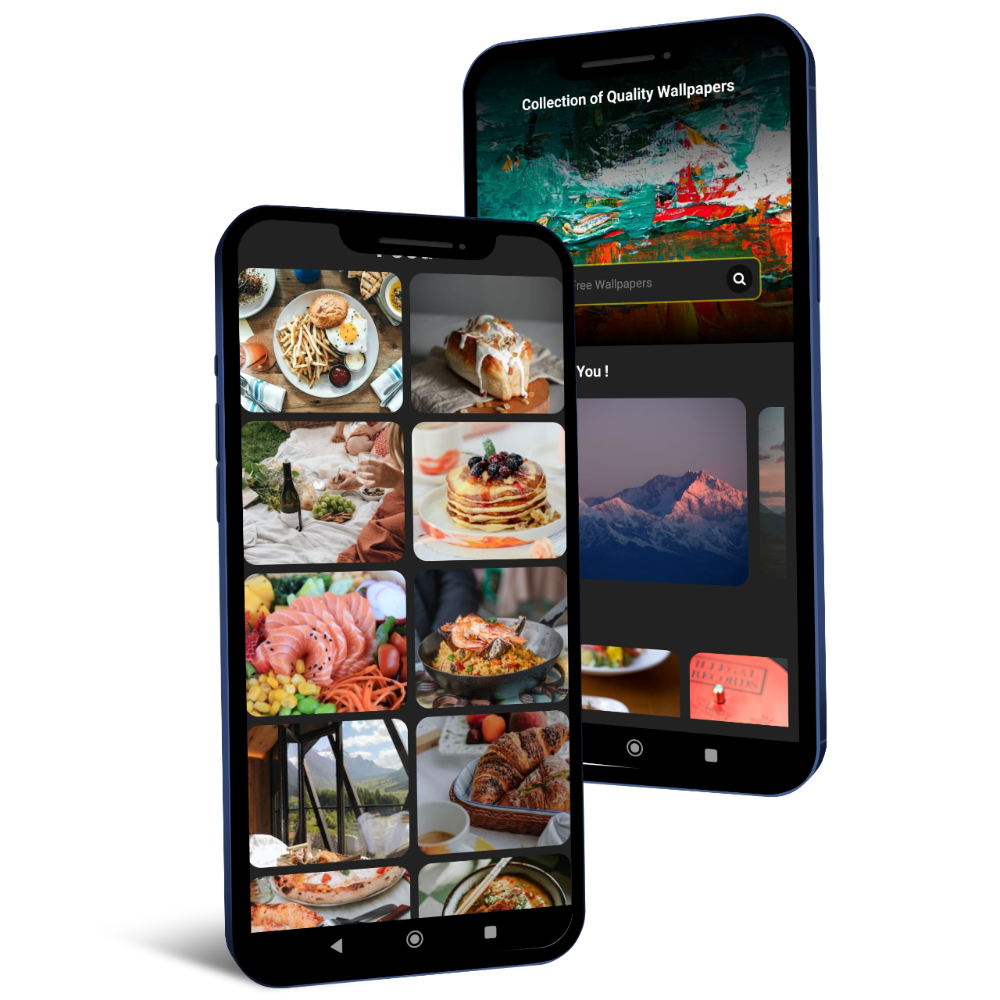
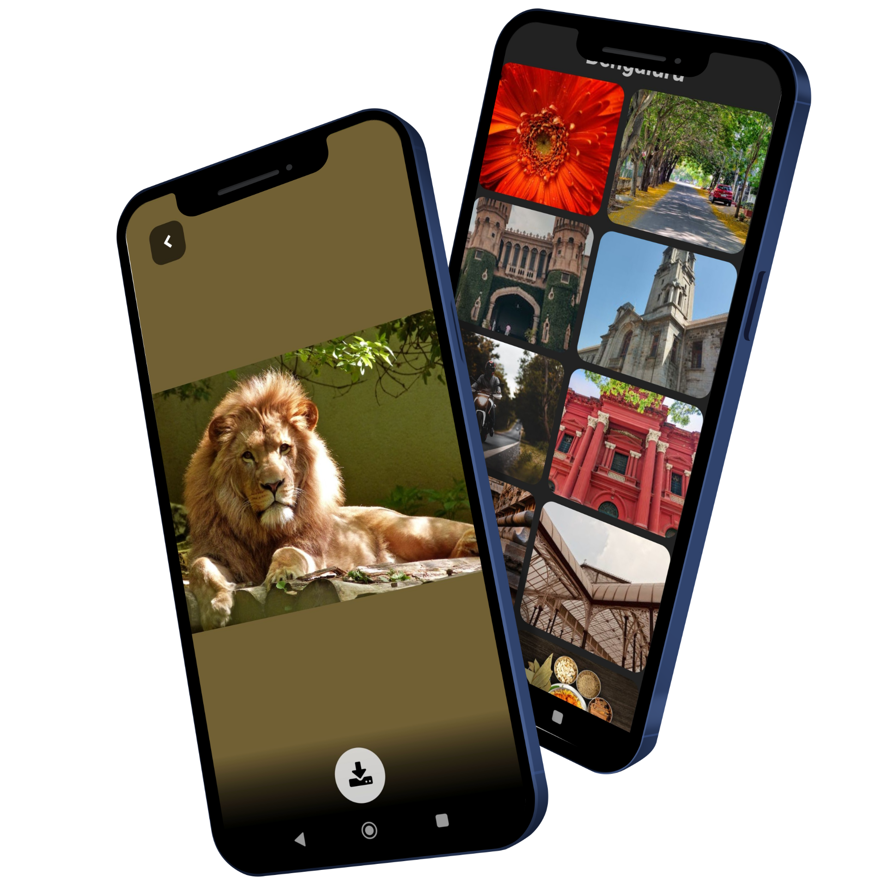

# Wallpaper App by KCN

### Mockup images

<div style="display: flex;">


</div>

### Features included in this app

- [Pexels API](https://www.pexels.com/api/) for loading the images.
- [React Navigation](https://reactnavigation.org/) for in-app navigation.
- [React Native Snap Carousel](https://github.com/meliorence/react-native-snap-carousel/) for image carousel in Home page.
- [React Native Gesture Handler](https://docs.swmansion.com/react-native-gesture-handler/) is needed by snap carousel for its use.
- [PermissionsAndroid](https://reactnative.dev/docs/permissionsandroid.html) to handle different scenarios of `PERMISSIONS.WRITE_EXTERNAL_STORAGE`. Have added [Rationale options](https://reactnative.dev/docs/permissionsandroid.html#request) to request method, when the user denies permission for the first time.
- Utilizing memoization techniques using [`useCallback`](https://react.dev/reference/react/useCallback), [`useMemo`](https://react.dev/reference/react/useMemo) and [`React.memo`](https://react.dev/reference/react/memo).

### Running the app in debug mode

1. Clone the repo

2. Get your own API Key from [Pexels API page](https://www.pexels.com/api/).

3. Put this key in a `.env` file in the root of the project (For clarity: it should be placed in the same directory along side `.eslintrc.js` and `.prettierrc.js` files). It should be named as follows:

   ```javascript
   PEXELS_API_KEY = YOUR_ACTUAL_KEY_FROM_PEXELS_API; // Replace your API Key here. NO need to add quotes. Also don't add space between equal sign (=), Key and Value.
   ```

4. ```sh
   yarn && yarn start
   ```

5. Connect your Android device to your machine and make sure `Developer Options` is enabled.

6. Also make sure you have `adb` installed. See a Youtube video on how to install it, if you don't know how to.

7. In another window of terminal, navigate to the root of the project and run

   ```sh
   cd android && ./gradlew installDebug && cd ..
   ```

8. After the app installs on your phone, run the below command to connect your app running on the phone to debugger on your terminal.

   ```sh
   adb reverse tcp:8081 tcp:8081
   ```

   > NOTE: This must be done each time you physically remove your phone's connection to your machine.

### Screenshots of the app

1. Home page


2. Category page - Items are rendered using a two column FlatList


3. Image Display page - User can download the image by clicking on the download button


4. Alert on successfully downloading the image


5. Search capability on Home page (Here the user has searched for "Bengaluru")


6. Search successfully renders itself as a `Category`


7. Once the user reaches the end of the list, an alert is shown for the same. The exact line in code can be seen [here](https://github.com/KiranCNayak/rn_app_03_wallpaper_app/blob/main/src/views/CategoryView/CategoryView.js#L45)


---

### Using `ProGuard` has decreased the App size by more than 7.5MB. The exact line in code can be seen [here](https://github.com/KiranCNayak/rn_app_03_wallpaper_app/blob/main/android/app/build.gradle#L57)

Without `ProGuard`


---

With `ProGuard`


